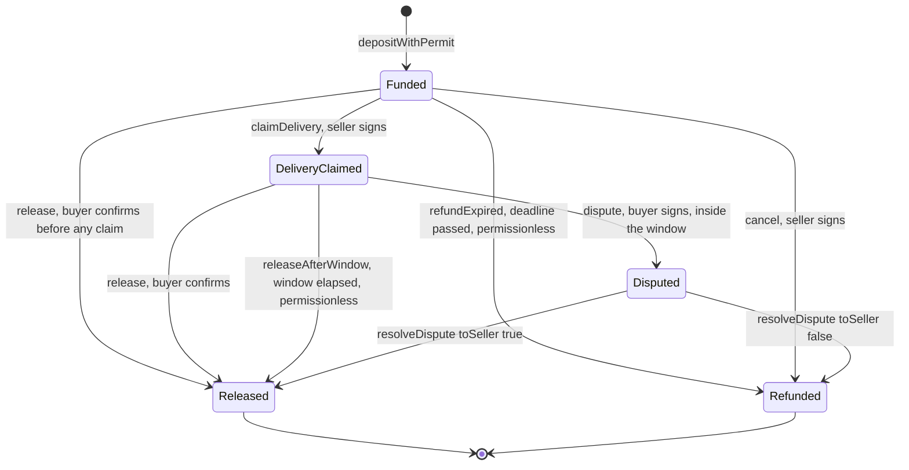
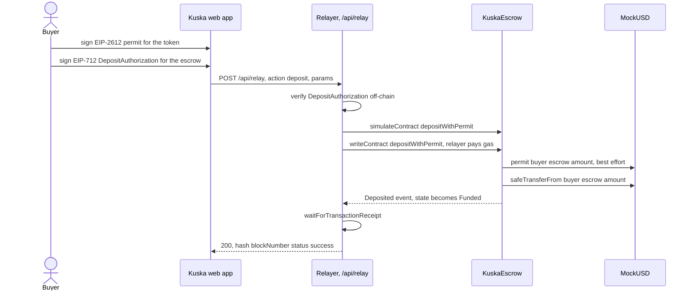

<p align="center">
  
</p>

# Kuska — custodia contra entrega

On-chain stablecoin escrow for B2B cash-on-delivery commerce on HSK Chain. The buyer pays without gas, the seller proves delivery with a signature and a QR, and funds only move when both sides agree — or when an explicit, on-chain rule (a deadline, a silence window, a declared arbiter) says they should.

**Demo:** https://kuska-beta.vercel.app (HSK Chain testnet, chain 133)

Built for the **Buildathon Ethereum Bolivia 2026** — **HSK Chain track**, also submitted to the **Real-World Ethereum Applications** main track.

> **Resumen en español:** Kuska es una custodia (*escrow*) on-chain para comercio B2B contra entrega, corriendo en HSK Chain. El comprador paga sin gas (firma un `permit` EIP-2612 y una autorización EIP-712; un relayer manda la transacción), el vendedor registra la entrega con su firma y muestra un QR, y el comprador libera los fondos al confirmar. Si nunca hubo entrega, el comprador puede recuperar su dinero (`refundExpired`); si el comprador queda en silencio tras la entrega, el vendedor cobra igual pasada una ventana de disputa (`releaseAfterWindow`); si hay desacuerdo, un árbitro declarado y centralizado resuelve (`dispute`/`resolveDispute`). Es aceptación optimista con ventana y árbitro, no un sistema sin confianza — el árbitro es centralizado y se declara así abiertamente.

---

## Table of contents

- [The problem](#the-problem)
- [How it works](#how-it-works)
- [Features](#features)
- [Architecture](#architecture)
- [HSK Chain integration](#hsk-chain-integration)
- [Security](#security)
- [Getting started](#getting-started)
- [Roadmap](#roadmap)
- [License](#license)

## The problem

In B2B cash-on-delivery commerce, someone always fronts the risk: the seller ships before getting paid, or the buyer pays before receiving the goods, or (in cash markets) a courier physically carries money that can be lost, stolen, or disputed. There's no cheap, neutral place to hold funds "in the middle" for the few hours between dispatch and delivery — especially when the buyer has no ETH/HSK to pay gas and shouldn't need to understand wallets to complete a purchase.

**Kuska's solution:** deploy a minimal, non-upgradeable escrow contract that holds a stablecoin deposit per order. The buyer authorizes the deposit off-chain (a signature, no gas); a relayer submits it on-chain. The seller marks delivery with a signature; the buyer confirms with a signature. Funds release automatically to the seller if the buyer never disputes within a fixed window, and refund automatically to the buyer if the seller never attempts delivery. A declared arbiter is the fallback for actual disagreements — nothing here is unlimited or silent.

## How it works

1. **Buyer** picks up an order and, from the web app, signs two EIP-712/EIP-2612 messages off-chain: an `EIP-2612 permit` (authorizing the escrow to pull the stablecoin) and a `DepositAuthorization` (the deal terms: order, seller, amount, delivery deadline). No gas, no on-chain transaction from the buyer.
2. **Relayer** (a Vercel Function) verifies both signatures, simulates and submits `depositWithPermit`, and pays the gas. The deal is now `Funded`.
3. **Seller** delivers the goods and calls `claimDelivery` (signature only, relayed the same way) before the delivery deadline. The web shows a QR with the order and amount.
4. **Buyer** scans/confirms delivery by signing `DeliveryConfirmation`; the relayer submits `release` and the seller gets paid.
5. **Anti-fraud, both directions:**
   - If the seller never claims delivery and the delivery deadline passes, anyone can call `refundExpired` (no signature needed) and the buyer gets their money back.
   - If the buyer never confirms after a claimed delivery, once the dispute window elapses anyone can call `releaseAfterWindow` and the seller gets paid — silence is not leverage.
   - If the buyer disputes within the window (`dispute`, signed), the deal moves to `Disputed` and the declared **arbiter** resolves it with `resolveDispute`, sending funds to either side.

### State machine

States and transitions are exactly as frozen in [`docs/escrow-interface.md`](docs/escrow-interface.md#3-kuskaescrow):



`orderRef` is never reused: once a deal reaches `Released` or `Refunded` it is terminal.

### Gasless deposit, sequence



## Features

- **Gasless deposits** — buyer signs a permit + a deposit authorization; the buyer never holds gas or submits a transaction.
- **Delivery-by-signature + QR** — the seller claims delivery with a signature; the web renders a QR the buyer scans to confirm.
- **Buyer-confirmed release** — funds move to the seller only after an explicit signed confirmation, or after the fallback rules below.
- **Expiry refund** (`refundExpired`) — permissionless recovery for the buyer if delivery was never claimed by the deadline.
- **Optimistic release after window** (`releaseAfterWindow`) — permissionless payout for the seller if the buyer goes silent after a claimed delivery.
- **Signed cancellation** (`cancel`) — the seller can void an unclaimed deal and refund the buyer.
- **Dispute + declared arbiter** (`dispute` / `resolveDispute`) — a single, named, centralized address resolves disagreements; this is stated openly, not hidden behind "decentralized" language.
- **EOA and smart-account signatures** — every signature is checked with OpenZeppelin's `SignatureChecker` (ECDSA or ERC-1271).
- **Relayer with no custody privileges** — no `Ownable`, no pause, no admin function anywhere in `KuskaEscrow`; the relayer is a gas-paying transaction submitter, nothing more.
- **Hardened relay pipeline** — whitelisted contract-address checks, off-chain signature verification before any simulation, typed viem error classification, bounded nonce retries, and no raw revert strings ever reach the client.
- **Testnet faucet with abuse controls** — per-address cooldown on-chain, per-IP rate limiting and a relayer gas floor off-chain.

## Architecture

```
contracts/     Foundry project: KuskaEscrow, MockUSD, deploy script, tests
web/           Vite + React app, viem escrow SDK, and the relayer as Vercel Functions
brand/         Logo and identity assets
docs/          Frozen escrow interface (source of truth) and brand tokens
```

### Contracts (`contracts/`)

- **Foundry**, Solidity `0.8.28`, `evm_version = "prague"` (pinned in [`foundry.toml`](contracts/foundry.toml) — this is the target the live chain-133 deployment was compiled with).
- **OpenZeppelin Contracts v5.1.0** (git submodule): `EIP712`, `ReentrancyGuard`, `SafeERC20`, `SignatureChecker`, `ERC20Permit`.
- `KuskaEscrow.sol` — the escrow described above. No `Ownable`, no setters, no pause; state is written before any transfer (checks-effects-interactions); every transfer path uses `SafeERC20`; every fund-moving function (`depositWithPermit`, `release`, `releaseAfterWindow`, `refundExpired`, `cancel`, `resolveDispute`) is `nonReentrant`. `claimDelivery` and `dispute` are not — they move no funds and only write deal state after a signature check, and that check's ERC-1271 path resolves via `staticcall`, so a malicious smart-account signer can't reenter and mutate state during verification.
- `MockUSD.sol` — a 6-decimal `ERC20Permit` demo stablecoin with a `faucet(address)` that mints 100 mUSD, gated by a 1-hour per-recipient cooldown.
- `script/Deploy.s.sol` — deploys `KuskaEscrow` (and `MockUSD` if no `TOKEN_ADDRESS` is given) and writes `deployments/<chainId>.json`. Guarded against accidental redeploys (see [Getting started](#getting-started)).

### Web (`web/`)

- **Vite 6**, **React 19**, **Tailwind CSS v4**, **viem 2.21** on the client (versions from [`web/package.json`](web/package.json)).
- `src/lib/escrow/` — the escrow SDK: ABI, EIP-712 typed-data builders, a `getDeal` reader, and human-readable error mapping.
- Frontend screens are actively being built out on top of this SDK; the buyer/seller flow described in [How it works](#how-it-works) reflects the frozen product flow in [`docs/escrow-interface.md`](docs/escrow-interface.md), not a snapshot of which page files currently exist.

### Relayer (`web/api/`, `web/server/`)

Deployed as three **Vercel Functions** (Web Fetch handlers, Node.js runtime):

| Endpoint | Purpose |
|---|---|
| `POST /api/relay` | Executes any signed escrow action (`deposit`, `claim`, `release`, `dispute`, `cancel`, `refundExpired`, `releaseAfterWindow`) on the buyer's/seller's behalf. |
| `POST /api/faucet` | Mints demo mUSD to a given address (testnet only — `404` on mainnet). |
| `GET /api/health` | Reports relayer balance, low-balance flag, and whether the configured token actually matches `escrow.token()`. |

**Relay pipeline** (`web/server/relay.ts`), in order:

1. Validate the request schema with `zod` — every numeric field is bounds-checked against its real Solidity type (`uint64`/`uint96`/`uint256`), so a malformed value never reaches `simulateContract`.
2. Confirm the escrow address actually has deployed bytecode (memoized per process, `contractGuard.ts`) before sending anything.
3. Verify the relevant EIP-712 signature **off-chain** (`viem`'s `verifyTypedData`) against the expected signer — for actions on an existing deal, the expected signer is read from `getDeal`.
4. `simulateContract`.
5. `writeContract`, with bounded retries (default: 2 retries, 3 attempts total, ~250ms apart) on a **typed** nonce error (`NonceTooLowError`/`NonceTooHighError`/`NonceMaxValueError`, never a substring match on the error message).
6. `waitForTransactionReceipt` (20s timeout); a mined-but-reverted transaction is reported as `409 TX_REVERTED`, never as success.
7. Any missing/invalid server env var degrades to `503 MISCONFIGURED` — never an opaque 500.

The faucet adds its own guards on top: a per-IP sliding-window rate limit (3 requests / 10 minutes, best-effort — serverless instances don't share state), and a relayer gas-floor check (0.02 HSK) before it will send a transaction at all.

**The relayer holds no privileges over funds.** It is a private key that pays gas and submits pre-authorized, pre-verified transactions; it cannot move funds outside what a valid buyer/seller signature (or an expired deadline/window) already permits on-chain.

## HSK Chain integration

| | Value |
|---|---|
| Network | HSK Chain Testnet (`hashkeyTestnet` in `viem/chains`) |
| Chain ID | `133` |
| RPC | `https://testnet.hsk.xyz` |
| Explorer | `https://testnet-explorer.hsk.xyz` |

### Deployed contracts (chain 133)

From [`contracts/deployments/133.json`](contracts/deployments/133.json):

| Contract | Address |
|---|---|
| `KuskaEscrow` | [`0x5dE999B6360494dd704369190bB8d49cc5e5328d`](https://testnet-explorer.hsk.xyz/address/0x5dE999B6360494dd704369190bB8d49cc5e5328d) |
| `MockUSD` (token) | [`0x64D9707dFf7e9c49B36b5025A70177eFe624793A`](https://testnet-explorer.hsk.xyz/address/0x64D9707dFf7e9c49B36b5025A70177eFe624793A) |
| Arbiter | [`0x3ED8c38464C7354BA9f3c85Cc952b397068e98ed`](https://testnet-explorer.hsk.xyz/address/0x3ED8c38464C7354BA9f3c85Cc952b397068e98ed) |
| Dispute window | `90` seconds |
| Deploy block | `32996664` |

These contracts are **deployed and reproducible but not verified** on the explorer. Local `forge build` output matches the on-chain runtime bytecode byte-for-byte, including the metadata hash (solc `0.8.28`, optimizer 200 runs, `evm_version = "prague"`), but Blockscout verification is blocked by two explorer-side limits: its gateway caps request bodies at ~102 KB (the flattened sources are 129–143 KB; stripping comments brings them to 52–62 KB and still compiles to identical runtime bytecode, which clears this limit), and this instance's allowed `evm_version` list ends at `cancun`, so it can't accept `prague` and reproduce the deployed bytecode. Sourcify can't verify chain 133 either — its registered RPC for the chain is currently misconfigured, so it fails to fetch bytecode. Verification will be possible once the explorer enables `prague`, or with a `cancun` redeploy. The address pages above still show live bytecode, balance, and transaction history.

Mainnet (chain `177`, `hashkey` in `viem/chains`) is deployed and verified — see [HSK Chain Mainnet (177)](#hsk-chain-mainnet-177) below.

**Why HSK Chain:** it is a standard EVM chain — the contracts needed no custom opcodes or non-standard precompiles, `viem` ships first-class `hashkeyTestnet`/`hashkey` chain definitions, and a public testnet RPC/faucet made it practical to run the full gasless-relayer flow end-to-end for the demo.

### HSK Chain Mainnet (177)

Deployed and verified on `hashkey` mainnet (chain `177`), RPC `https://mainnet.hsk.xyz`, explorer `https://hsk.blockscout.com`. From [`contracts/deployments/177-musd-demo.json`](contracts/deployments/177-musd-demo.json) and [`contracts/deployments/177.json`](contracts/deployments/177.json):

| Contract | Address | Verified |
|---|---|---|
| `MockUSD` ("Kuska Demo USD", mUSD, 6 dec, EIP-2612 permit, public faucet) | [`0x1dfAC4096b94Ed6d892223573d289B8165695dB0`](https://hsk.blockscout.com/address/0x1dfAC4096b94Ed6d892223573d289B8165695dB0) | Yes |
| `KuskaEscrow` bound to mUSD (used for the end-to-end deal below) | [`0x955e09d2D14431f491F8E80A4db3CE82A2b3Dba1`](https://hsk.blockscout.com/address/0x955e09d2D14431f491F8E80A4db3CE82A2b3Dba1) | Yes |
| `KuskaEscrow` bound to USDC.e (production configuration, no payment through it yet) | [`0xD11f19dC37a98b5008f7Ad60A93D93fd92cab644`](https://hsk.blockscout.com/address/0xD11f19dC37a98b5008f7Ad60A93D93fd92cab644) | Yes |
| Arbiter (both escrows) | [`0x3ED8c38464C7354BA9f3c85Cc952b397068e98ed`](https://hsk.blockscout.com/address/0x3ED8c38464C7354BA9f3c85Cc952b397068e98ed) | — |
| Dispute window (both escrows) | `86400` seconds, 24h (testnet uses `90`s for the demo) | — |

The three deployments together cost 2.354 HSK at ~500 gwei base fee.

**End-to-end deal on mainnet**, run through the real web app (local build pointed at chain 177, same relayer code as production), 1 mUSD, order ref `0x4a1d716b140e4688f3a0b9926b623c1488d3d0322b7888e0b84bfd8f015f43e5`:

| Step | Tx | Gas paid by |
|---|---|---|
| Faucet mint to buyer | [`0xe79dd1966f9e6d7cda702c1c6a6aee41b1ef10ed970e97e43a6099e2899e9228`](https://hsk.blockscout.com/tx/0xe79dd1966f9e6d7cda702c1c6a6aee41b1ef10ed970e97e43a6099e2899e9228) | Relayer |
| Deposit (permit + relayed) → `Funded` | [`0x9b87478b5543ba04317062729583392fa026d2dafc2662d64d3c0fdbff47fabe`](https://hsk.blockscout.com/tx/0x9b87478b5543ba04317062729583392fa026d2dafc2662d64d3c0fdbff47fabe) | Relayer |
| Delivery claim (seller-signed, relayed) → `DeliveryClaimed` | [`0xa41ff80e020f27f790db41e0cf30558e0c3d76f7ef2068c40d70f8a282093449`](https://hsk.blockscout.com/tx/0xa41ff80e020f27f790db41e0cf30558e0c3d76f7ef2068c40d70f8a282093449) | Relayer |
| Buyer confirmation → `release` → `Released` | [`0xd21141acb8daf9466a6a32ab2c43476ebf29c86021fefad93cef5a77a34b2355`](https://hsk.blockscout.com/tx/0xd21141acb8daf9466a6a32ab2c43476ebf29c86021fefad93cef5a77a34b2355) | Relayer |

Buyer and seller held 0 HSK throughout the deal (gasless confirmed by `cast balance`); the seller received 1 mUSD and the escrow balance returned to 0; final `getDeal` state was 4 (`Released`); the seller page discovered the order on its own from mainnet event logs. The faucet mint plus the 3 relayed transactions cost 0.188 HSK total, all paid by the relayer.

**Why a demo token, not USDC.e, for the deal above:** as of 2026-09-13 there was no usable USDC.e liquidity on HSK Chain mainnet (the only WHSK/USDC.e pool on HyperIndex held 0.000001 USDC.e; quotes returned 0), and the liquid USDT ([`0xF1B50eD67A9e2CC94Ad3c477779E2d4cBfFf9029`](https://hsk.blockscout.com/address/0xF1B50eD67A9e2CC94Ad3c477779E2d4cBfFf9029)) has no EIP-2612 permit, which Kuska's gasless flow requires. So the end-to-end run used mUSD, a demo token with no monetary value; the USDC.e-bound escrow above is deployed and verified, ready for a real payment once USDC.e liquidity is available. The public demo (`kuska-beta.vercel.app`) stays on HSK Chain Testnet 133, where a faucet exists — mainnet has no faucet by design.

## Security

- **35/35 contract tests pass** (`forge test`, [`contracts/test/KuskaEscrow.t.sol`](contracts/test/KuskaEscrow.t.sol)) — covering the full state machine, signature tampering (wrong signer, wrong typehash, wrong verifying contract, tampered amount/deadline/seller), expiry/window boundaries (off-by-one on both sides), races (`cancel` vs `claim`, `claim` vs `refund`, `dispute` vs `releaseAfterWindow`), permit front-running, and arbiter-only access on `resolveDispute`.
- **62/62 web/relayer tests pass** (`npx vitest run` in `web/`) — covering the relay pipeline's error taxonomy, nonce-retry classification, the faucet's rate limiter and balance floor, `/api/health`'s degraded-RPC behavior, and EIP-712 typed-data construction.
- Contract-level protections: checks-effects-interactions ordering, `nonReentrant` on every fund-moving function, `SafeERC20` for all transfers, `SignatureChecker` for EOA + ERC-1271 signatures, immutable `token`/`arbiter`/`disputeWindow` (no admin surface at all).
- Relayer-level protections: schema validation with real ABI-type bounds, contract-bytecode checks before any transaction, off-chain signature pre-verification, and no internal error detail (env var names, stack traces) ever returned to the client.

### Known limitations

- **The arbiter is centralized.** `resolveDispute` trusts a single declared address (see the table above). This is a documented design choice for the demo, not a decentralized dispute mechanism.
- **`Disputed` has no timeout.** Once a deal is disputed, it stays `Disputed` until the arbiter calls `resolveDispute` — there is no automatic fallback if the arbiter never acts.
- **`refundExpired` can front-run a late `release`.** Because `refundExpired` requires no signature and only checks that `deliveryDeadline` has passed while `state == Funded`, it can beat a `release` transaction built from a buyer signature whose `sigDeadline` outlives `deliveryDeadline` — whichever transaction lands first wins. Defense: the seller should call `claimDelivery` before `deliveryDeadline`, which moves the deal out of `Funded` and makes `refundExpired` inapplicable.
- **Nonce serialization is per serverless instance only.** The relayer's in-memory nonce mutex (`web/server/relay.ts`) prevents two concurrent requests on the *same* warm Vercel instance from colliding on a nonce; it does nothing across different instances. A cross-instance lock (e.g. Redis) is out of scope for this demo.
- **The `MockUSD` faucet cooldown can be griefed.** `faucet(address to)` is callable by anyone for any `to`, and starts that address's 1-hour cooldown on the first call — a third party can lock out a legitimate recipient by calling the faucet on their behalf. It's a demo-only token with no monetary value, so the impact is a UX annoyance, not a fund-safety issue.

## Getting started

### Prerequisites

- Node.js 22 and npm (matches [`.github/workflows/ci.yml`](.github/workflows/ci.yml))
- [Foundry](https://getfoundry.sh) (`forge`)
- Git with submodule support

### Clone

```bash
git clone --recurse-submodules git@github.com:JoseluisLarrazabal/kuska.git
cd kuska
# if you cloned without --recurse-submodules:
git submodule update --init --recursive
```

### Contracts

```bash
cd contracts
forge build
forge test
```

### Web + local relayer

```bash
cd web
npm ci
cp .env.example .env
```

Fill in `.env`:
- **Client** (`VITE_` prefix, embedded in the bundle): `VITE_CHAIN_ID`, `VITE_ESCROW_ADDRESS`, `VITE_TOKEN_ADDRESS`, `VITE_DEPLOY_BLOCK`, `VITE_DEMO_SELLER` — for the live testnet deployment, the addresses come from [`contracts/deployments/133.json`](contracts/deployments/133.json).
- **Server** (never `VITE_`-prefixed, never committed with real values): `CHAIN_ID`, `RPC_URL`, `ESCROW_ADDRESS`, `TOKEN_ADDRESS`, `RELAYER_PRIVATE_KEY`.

Run the app and its local relayer API in two terminals:

```bash
npm run dev:api   # local relayer API on http://localhost:8787
npm run dev       # Vite dev server; proxies /api/* to :8787
```

Other scripts (from `web/package.json`):

```bash
npm run typecheck   # tsc --noEmit
npm test            # vitest run
npm run build        # tsc --noEmit && vite build
```

### Deploying the contracts

```bash
cd contracts
export DEPLOYER_PRIVATE_KEY=0x...
export ARBITER_ADDRESS=0x...
# optional: DISPUTE_WINDOW (default 90), TOKEN_ADDRESS (deploys a fresh MockUSD if omitted, chain 133/31337 only)
forge script script/Deploy.s.sol --rpc-url hsk_testnet --broadcast
```

The script refuses to run if `deployments/<chainId>.json` already exists, to avoid orphaning a live deployment:

```
deployments/133.json already exists; re-running this script would orphan the live deployment. Set ALLOW_REDEPLOY=true to override.
```

Set `ALLOW_REDEPLOY=true` to intentionally overwrite it. `hsk_testnet`/`hsk_mainnet` are RPC aliases defined in [`contracts/foundry.toml`](contracts/foundry.toml).

## Roadmap

- ~~Mainnet deployment (chain `177`)~~ — done: both `KuskaEscrow` (mUSD and USDC.e configurations) are deployed and verified, and an end-to-end deal has run on mainnet with the demo mUSD token (see [HSK Chain Mainnet (177)](#hsk-chain-mainnet-177)). Remaining: a real payment through the USDC.e-bound escrow once USDC.e liquidity is available, and a production mainnet build of the frontend (the public demo stays on testnet 133).
- A timeout or fallback path for `Disputed` deals, and/or a less centralized arbitration mechanism.
- KYC on buyer/seller onboarding (explicitly out of scope today).
- EIP-3009 (`transferWithAuthorization`) as an alternative to EIP-2612 permit for tokens that support it (explicitly out of scope today).
- A cross-instance nonce lock for the relayer (e.g. Redis-backed), removing the per-serverless-instance limitation above.

## License

License: TBD (no `LICENSE` file is present in this repository yet).
